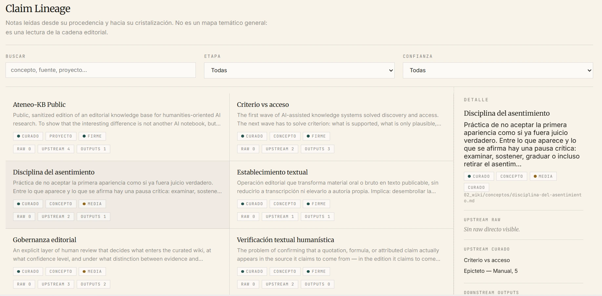
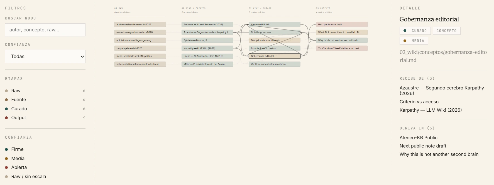

# Ateneo-KB Public

An editorial knowledge base where AI assists compilation but humans govern judgement.

## The problem

Most LLM-assisted knowledge systems optimise for recall: find more, retrieve faster, summarise better. But in domains where interpretation matters — philosophy, philology, psychoanalysis, historiography — the hard problem is not finding a passage. It is deciding how far a reading can travel before it stops being evidence and becomes conjecture.

Current tools collapse that distinction. A retrieved fragment looks the same whether it is a verified quotation or a plausible hallucination. Confidence is invisible. Provenance is implicit. The editorial layer — who decided this claim is supported, at what level, from which source — disappears.

Ateneo-KB is a working method for keeping that layer visible.

## What this is

A structured, replicable knowledge base that separates:

- **Raw captures** — immutable source material, never rewritten
- **Curated sources** — human-reviewed notes with explicit provenance and confidence
- **Concepts** — interpretive nodes that distinguish firm evidence from open reading from working hypothesis
- **Outputs** — derived pieces (memos, arguments, public writing) that trace back to curated material

Every note declares its sources, its confidence level (`firme` · `media` · `abierta`), and its epistemic status (`evidencia firme` · `lectura abierta` · `hipótesis abierta`). Nothing enters the curated layer without review. Nothing claims more support than it has.

## What this is not

This is not another second brain, not a note-taking app, not an AI-powered personal wiki. The architecture follows [Karpathy's LLM Wiki pattern](https://gist.github.com/karpathy/442a6bf555914893e9891c11519de94f) (`raw → wiki → outputs`), but adds what that pattern intentionally leaves open: editorial governance for domains where getting it wrong has consequences.

## Structure

```
00_inbox/      unprocessed captures (excluded from public sample)
01_raw/        immutable source material
02_wiki/       curated notes, concepts, projects, and generated indices
03_outputs/    derived public-facing pieces
04_ops/        scripts, templates, operational log
```

## Generated surfaces

Three scripts produce auditable views of the knowledge base:

- **Wiki graph** — dependency map across all notes (`wiki_graph.py`)
- **Lineage map** — traces how raw captures become curated claims and then public outputs (`render_lineage_map.py`)
- **Editorial dashboard** — review queue, confidence distribution, and proof surface (`render_editorial_dashboard.py`)





Two short companion docs make the public sample easier to inspect:

- [QUICKSTART.md](QUICKSTART.md) — run the sample in a few minutes
- [docs/review-flow.md](docs/review-flow.md) — see how a raw source becomes a reviewed concept and then an output

## Public sample

This repository contains a minimal curated sample — enough to demonstrate the method, not to replicate a full working corpus. The sample includes:

- a denser psychoanalytic chain (Lacan/Miller) that shows editorial judgement under copyright constraints
- a fully public-domain Stoic chain (Epictetus) that can be audited end to end by anyone cloning the repo

Together they show both depth and portability.

## Relation to Ateneo

This method powers the editorial research behind [Ateneo](https://ateneo.pablomartinezsamper.com), a citation verification instrument for humanistic corpora. Ateneo verifies quotations against indexed primary sources; Ateneo-KB governs the knowledge layer underneath — where interpretive claims are tracked, sourced, and kept honest.

## Running the scripts

```bash
python 04_ops/scripts/wiki_graph.py          # dependency graph
python 04_ops/scripts/wiki_graph.py --strict  # strict mode (flags broken links)
python 04_ops/scripts/render_lineage_map.py   # raw → source → concept → output lineage
python 04_ops/scripts/render_editorial_dashboard.py  # editorial review dashboard
```

Requires Python 3.10+. No external dependencies beyond the standard library.

If you want the fastest route through the sample, start with [QUICKSTART.md](QUICKSTART.md).

## Replicating the method

The value here is the pattern, not this particular corpus. To adapt Ateneo-KB to another domain:

1. Define your raw capture sources and keep them immutable
2. Use the note templates in `04_ops/templates/` — each enforces provenance and confidence metadata
3. Separate what you can defend from what you are reading into the text
4. Run the scripts to generate auditable surfaces
5. Let the dashboard tell you where your knowledge base is strong and where it is exposed

## Design principles

- **Criterion over access.** Retrieval is solved. Judgement is not.
- **Confidence is metadata, not rhetoric.** Every note declares `firme`, `media`, or `abierta` — and means it.
- **Provenance is structural.** Sources link to raw captures. Concepts link to sources. Outputs link to concepts. The chain is always traversable.
- **Silence is a valid answer.** If there is no evidence, the note says so. The system does not hallucinate support.
- **The human governs.** AI assists capture and compilation. The editorial decision — what to promote, what to hold, what to flag — stays with the researcher.

## Licence

Scripts: [MIT](LICENSE-MIT)
Editorial content and templates: [CC BY 4.0](LICENSE-CC-BY)

A short split-licence summary is also available in [LICENSE](LICENSE).

## Author

Pablo Martínez Samper — [pablomartinezsamper.com](https://pablomartinezsamper.com)
